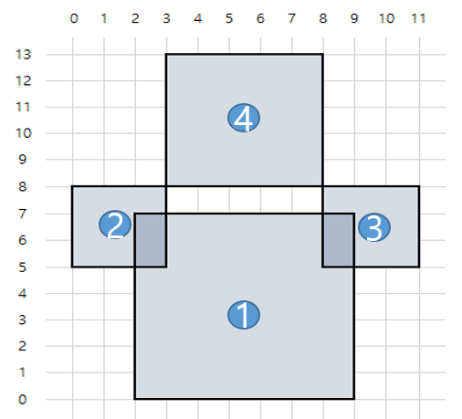
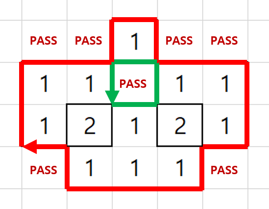
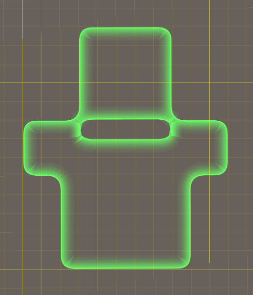

# Area

오션앤 앰파이어, 캐리비안의해적, 크로스파이어, 창세기전, 건쉽 배틀 및 모든 신작 프로젝트의 

연맹영역 구성 및 외곽라인 생성에 공용으로 사용하고 있습니다.

업로드한 코드는 크로스파이어의 연맹영역 점유 규칙에 기반된 코드 입니다.

</img>
</img>

## Youtube

## Compile

Unity 2020.3.2f1 를 기반으로 컴파일되도록 작성하였습니다.

2021년 6월 현재 가장최신 프로젝트에 탑제되는 URP, DOTS 기반의 코드와 리소스들로 구성하였습니다.

</img>

## Description

연맹이 연맹영역을 확보할 수 있는 연맹 건물들을 필드에 건설하게 되면

연맹영역이 생성되어지고 같은 연맹의 연맹영역들은 서로 합쳐져서 특정 영역을 연맹의 영역으로 확보하게 됩니다.

이를 시각적으로 구성하여 보여주고자 하였고, 여러 방법들중 외곽라인들로만 깔끔하게 표시하도록 하였습니다.

시간이 흘러 여러 프로젝트에 적용을 하면서 게임들마다 연맹영역의 확보에 대한 규칙들이 달라지기 시작하였습니다.     

- 오션앤 앰파이어, 캐리비안의해적, 창세기전, 건쉽 배틀 : 타 연맹과 연맹영역이 겹치지 않는다 가 규칙이었습니다.

- 크로스파이어 : 타 연맹과 영역이 겹치더라도 먼저 건설을 완료한 연맹이 영역의 소유권을 갖는다 가 규칙입니다.

연맹영역의 외곽라인을 만드는 알고리즘은 99% 동일하나, 연맹영역을 계산하기 위한 연산 GROUP 을 만들어주는 규칙이 다르게 구성되어져 있습니다.

연맹마다 하나의 GROUP으로 만들어졌던 전작들과 달리 

크로스 파이어는 타 연맹과 연맹영역이 서로겹쳐지는 연맹영역들의 GROUP 으로 변경된 것입니다.
